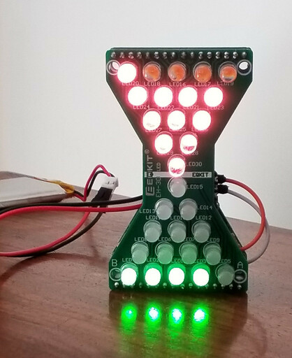
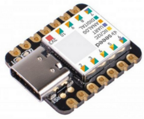
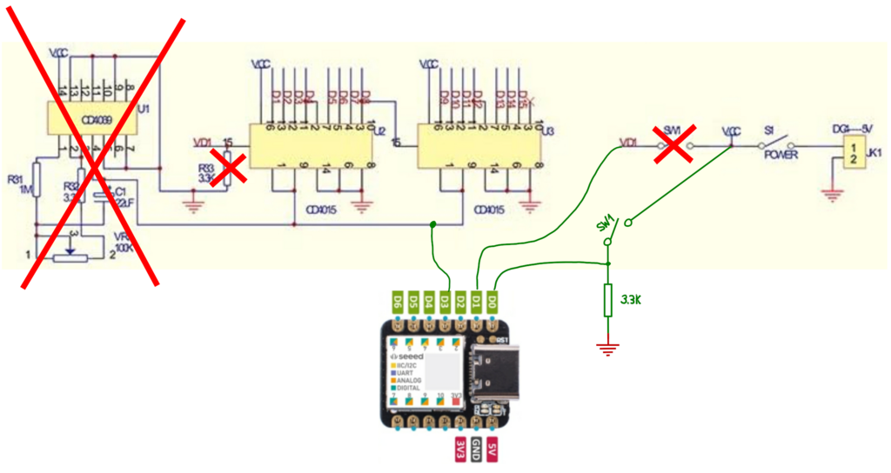
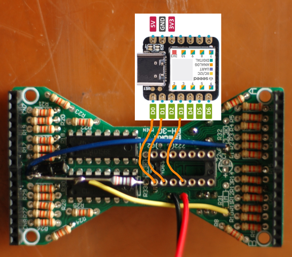
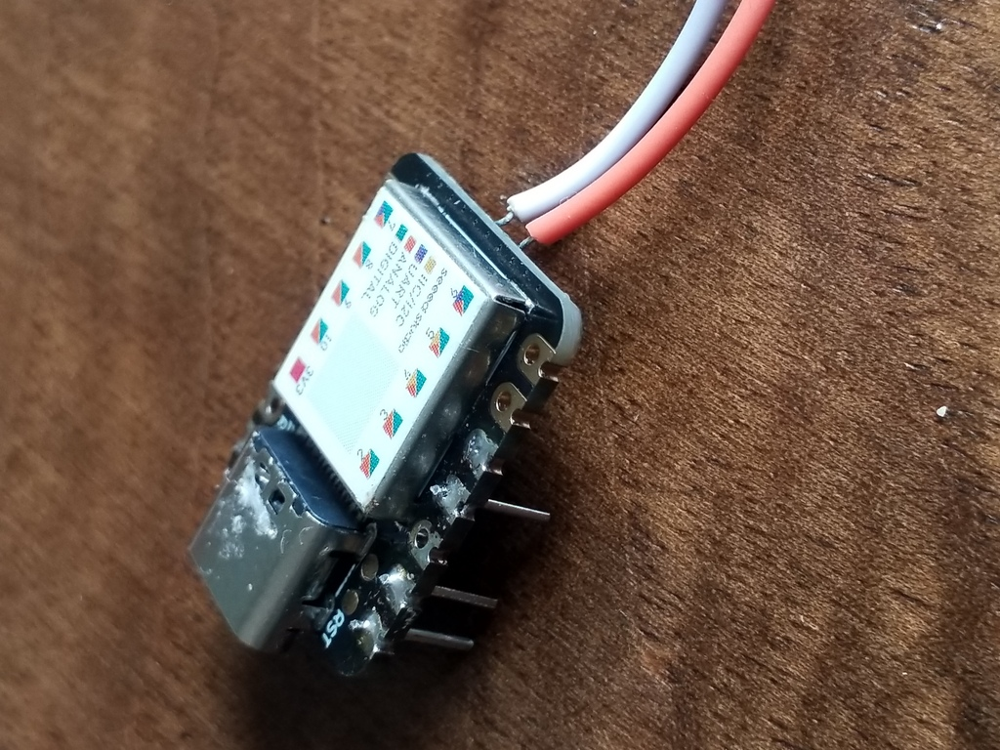
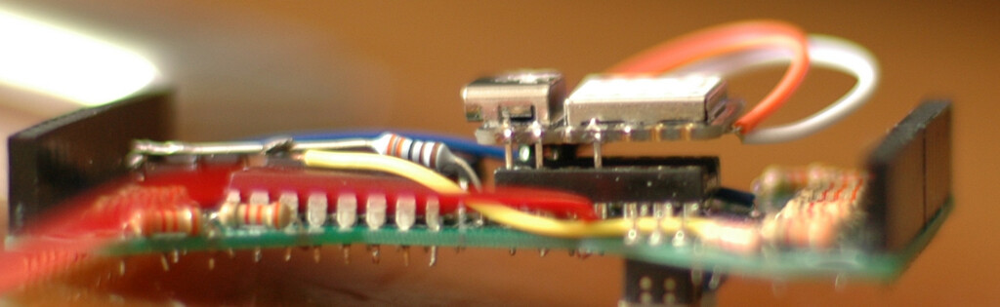
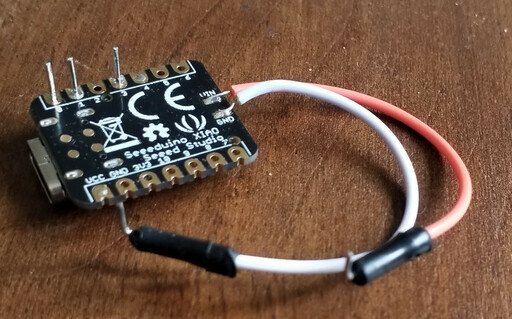
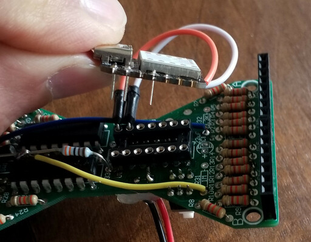

# pomodoro-timer

Simple electronics & sw hack to turn the nice '[Kyrio Hourglass DIY Soldering Kit](https://www.amazon.de/-/en/Electronic-Hourglass-Flashing-Soldering-Adjustable-Green/dp/B082HP7TFX/)' into a Pomodoro Timer as used in the [Pomodoro Technique](https://francescocirillo.com/pages/pomodoro-technique).

Typical Pomodoro Cycle:
- 25 mins of concentrated work : red LED "sand" falling down LED by LED
- blinking means it's time to turn the hourglass for the next part
- 5 mins of relaxing break : green LED "sand" falling down LED by LED
- repeat

Original behavior of the Kyrio Hourglass:

It has a clock which can be adjusted with the Potentiometer on the back (max. time is a few minutes).
With every clock cycle the shift register CD4015 loads the currently active level according the Ball tilt switch and shifts the current pattern one step further: one LED after the other gets turned on/off depending on the orientation. The LEDs on the other half of the hourglass do the opposite which gives the impression of a sand clock.

To turn this into a Pomodoro Timer we make the following changes:

- remove clock built around CD4069 and replace it with a tiny microcontroller that will provide the clock instead: this allows us to have different times depending on the orientation (25 min / 5 min), as well as blinking patterns to indicate when the time is up.
- feed Ball tilt switch signal into MCU: SW must act according the current orientation
- use digital output of MCU as input into the shift registers
- replace half of the LEDs with red LEDs : pomodoro (i.e. tomato) red is work, green is relaxation

## hardware

As MCU the tiny & cheap (5EUR) [Seeeduino XIAO](https://wiki.seeedstudio.com/Seeeduino-XIAO/) was chosen since mechanically it's almost a drop-in replacement of the CD4069.

Instructions:

1. get the required HW:

  - Kyrio Hourglass DIY Soldering Kit, e.g. from [here](https://www.amazon.de/-/en/Electronic-Hourglass-Flashing-Soldering-Adjustable-Green/dp/B082HP7TFX/). For roughly 11 EUR you get a set containing 2 kits.
  - Seeeduino XIAO: e.g. from [amazon](https://www.amazon.com/Seeeduino-Smallest-Microcontroller-Interfaces-Compatible/dp/B08CN5YSQF)
  - 15 LEDs, red (like a pomodoro/tomato), 5mm
  - 3.7V LiPo accu. The Pomodoro Timer runs at 18mA current, so even with a tiny 900mAh accu it runs for a full work week including overtime (50h)
  - DIL14 socket, height as small as possible. Will be used for the XIA0 board so that it can easily be re-programmed later on.

2. assembly / soldering of the kit

  Follow the instructions, leave all components out that are part of the clock functionality. Here's the updated schematics (new components in green):

  

  Modified instructions:

  - step 1: R31 unused
  - step 2: C2 unused
  - step 3: C1 unused
  - step 4: Ball tilt switch: only solder the pin connected to VCC (the one close to R16, **not** R30). The other leg gets soldered to one of the unused 3.3kOhm resistors which serves as a pull-down. The other end of this resistor goes into the hole for R33 (end next to label 'U1'). See photo below.
  - step 5: VR1 unused
  - step 7: U1 unused. Solder in a DIL14 socket instead which will be used as connector for the XIA0 MCU

3. modifications to make use of XIA0 MCU

   

  - Ball tilt switch / 'orientation' signal: connect the loose end (the one we soldered the pull-down resistor onto) to the hole of R31 (end close to R10, **not** R13), see yellow cable in photo above.  
    That way the orientation info will be available as digital input on D0 of the MCU.
  - 'VD1' signal: the hole on the PCB we did not use for the Ball tilt switch will now be connected to the free hole of R32 (the one close to R2, **not** R5), see blue cable in photo above.  
    That way the 'VD1' signal will be fed by digital output D1 of the MCU.
  - solder 3 metallic pins into D0, D1 & D3 of the XIA0 (easiest if you plug them first into the DIL14 socket and then add the XIA0 PCB). Leave about 3mm space

     

  - power supply of XIA0: solder 2 cables to the power supply pads at the bottom of the PCB (VIN & GND).
    I used cables as typically used for prototyping with breadboards and cut them in half. The end with the hard pin can be used to easily plug them into the DIL14 socket.

    

**WARNING**: the Seeeduino XIAO is a 3.3V device -- if you want to power your Pomodoro Timer via USB you either need a voltage level shifter or a 3.3V regulator.

SW:

- set up support in Arduino IDE for the XIA0 according their very nice instructions: [Getting Started with Seeed Studio XIAO SAMD21#Software](https://wiki.seeedstudio.com/Seeeduino-XIAO/#software).  
  Check if the board works by trying out the blink example (I had to follow the instructions about the bootloader first).
- import `pomodoroTimer/pomodoroTimer.ino` into Arduino IDE, build & upload
- plug the XIA0 PCB into the DIL14 socket including cable for power (GND into PIN13, VIN into PIN14)

  

- plug the LED PCB onto the main PCB according the A/B symbols. Check that the LED pins do not touch the XIA0's USB-C adapter (you might have to put a small sticker onto the metal housing as an isolator).
- turn it on & have fun while working the pomodoro way

